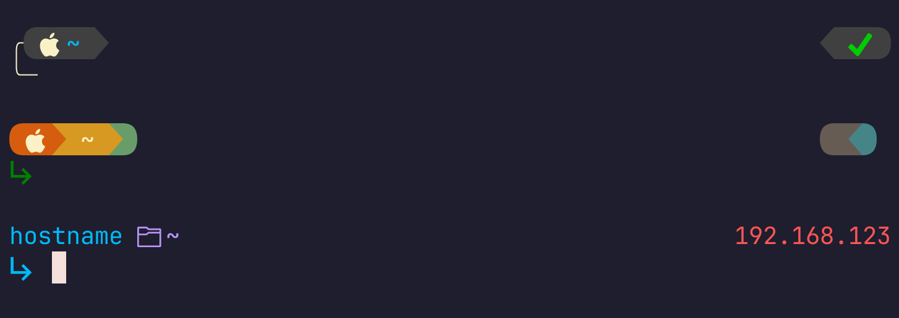
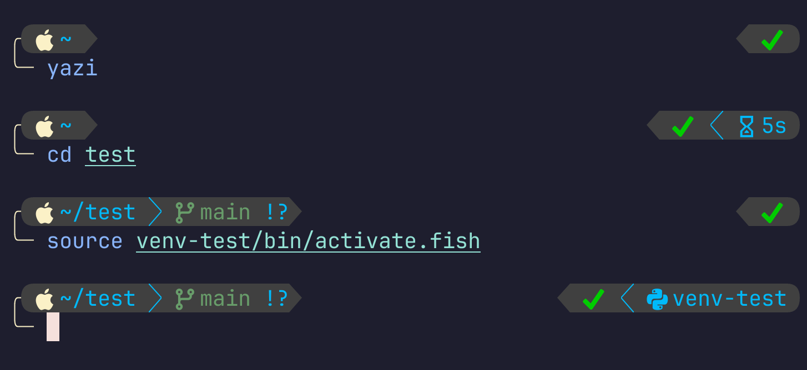
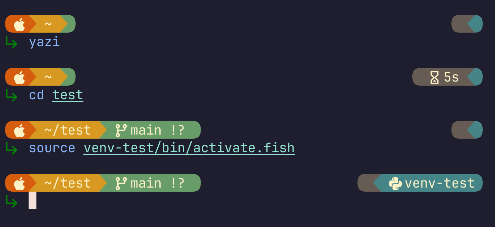
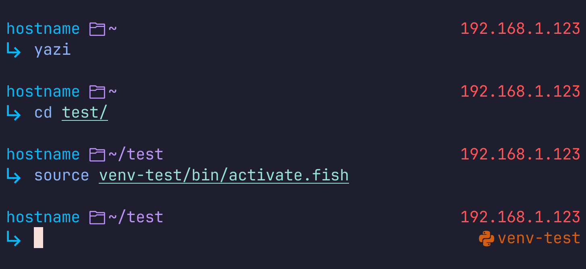

# Starship Prompt Themes




# pl10k

Based off of a [Powerlevel10k](https://github.com/romkatv/powerlevel10k) theme.



```toml
"$schema" = 'https://starship.rs/config-schema.json'
palette = "10k"

format = """
[╭](color_fg0)\
[](color_grey)\
$os\
$directory\
$git_branch\
$git_status\
[](fg:color_grey)\
$fill\
[](fg:color_grey)\
$character\
$cmd_duration\
$python\
[](color_grey)\
$line_break[╰─ ](bold fg:color_fg0)"""

[palettes.10k]
color_grey = '#404040'
color_blue = '#00bafa'
color_fg0 = '#fbf1c7'
color_red = '#8c1919'
color_green = '#00cd00'
color_aqua = '#689d6a'
dracula_purple = '#bd93f9'
dracula_yellow = '#f1fa8c'
dracula_red = '#ff5555'

[os]
disabled = false
style = "bg:color_grey fg:color_fg0"
format = "[$symbol ]($style)"

[os.symbols]
Windows = "󰍲"
Ubuntu = "󰕈"
SUSE = ""
Raspbian = "󰐿"
Mint = "󰣭"
Macos = "󰀵"
Manjaro = ""
Linux = "󰌽"
Gentoo = "󰣨"
Fedora = "󰣛"
Alpine = ""
Amazon = ""
Android = ""
Arch = "󰣇"
Artix = "󰣇"
EndeavourOS = ""
CentOS = ""
Debian = "󰣚"
Redhat = "󱄛"
RedHatEnterprise = "󱄛"
Pop = ""

[directory]
style = "fg:color_blue bg:color_grey"
format = "[$path ]($style)"
fish_style_pwd_dir_length = 1
truncation_length = 2
truncation_symbol = "…/"
 
[git_branch]
disabled = false
symbol = ""
style = "fg:color_aqua bg:color_grey"
format = '[[ ](bg:color_grey fg:color_blue)$symbol $branch ]($style)'

[git_status]
disabled = false
style = "fg:color_blue bg:color_grey"
format = '[$all_status$ahead_behind]($style)'

[fill]
symbol = ' '

[character]
disabled = false
success_symbol = '[  ](bold fg:color_green bg:color_grey)'
error_symbol = '[  ](bold fg:dracula_red bg:color_grey)'
vimcmd_symbol = '[  ](bold fg:dracula_purple bg:color_grey)'
vimcmd_replace_one_symbol = '[  ](bold fg:dracula_purple bg:color_grey)'
vimcmd_replace_symbol = '[  ](bold fg:dracula_red bg:color_grey)'
vimcmd_visual_symbol = '[  ](bold fg:dracula_yellow  bg:color_grey)'
format = '$symbol'

[cmd_duration]
style = "fg:color_blue bg:color_grey"
format = '[ [](fg:color_blue bg:color_grey) 󱦟 $duration]($style)'

[python]
symbol = ""
style = "bg:color_grey fg:color_blue"
pyenv_version_name = false
detect_extensions = []
detect_files = []
format = '[[ ](fg:color_blue bg:color_grey) $symbol $virtualenv]($style)'
```

# gruvboxExtra

Based off of [Gruvbox Rainbow](https://starship.rs/presets/gruvbox-rainbow) theme.



```toml
"$schema" = 'https://starship.rs/config-schema.json'
palette = "gruvbox_extra"

format = """
[](color_orange)\
$os\
[](bg:color_yellow fg:color_orange)\
$directory\
[](fg:color_yellow bg:color_aqua)\
$git_branch\
$git_status\
[](color_aqua)\
$fill\
$cmd_duration\
$python\
$line_break$character"""

[palettes.gruvbox_extra]
color_fg0 = '#fbf1c7'
color_bg3 = '#665c54'
color_blue = '#458588'
color_aqua = '#689d6a'
color_orange = '#d65d0e'
color_red = '#f38ba8'
color_yellow = '#d79921'
dracula_purple = '#bd93f9'
dracula_yellow = '#f1fa8c'
dracula_red = '#ff5555'
another_green = '#008000'

[os]
disabled = false
style = "bg:color_orange fg:color_fg0"

[os.symbols]
Windows = "󰍲"
Ubuntu = "󰕈 "
SUSE = ""
Raspbian = "󰐿"
Mint = "󰣭"
Macos = "󰀵 "
Manjaro = ""
Linux = "󰌽"
Gentoo = "󰣨"
Fedora = "󰣛"
Alpine = ""
Amazon = ""
Android = ""
Arch = "󰣇"
Artix = "󰣇"
EndeavourOS = ""
CentOS = ""
Debian = "󰣚"
Redhat = "󱄛"
RedHatEnterprise = "󱄛"
Pop = ""

[directory]
style = "fg:color_fg0 bg:color_yellow"
#format = "[  $path ]($style)"
format = "[ $path ]($style)"
fish_style_pwd_dir_length = 1
truncation_length = 3
truncation_symbol = "…/"

[git_branch]
symbol = ""
style = "bg:color_aqua"
format = '[[ $symbol $branch ](fg:color_fg0 bg:color_aqua)]($style)'

[git_status]
style = "bg:color_aqua"
format = '[[($all_status$ahead_behind )](fg:color_fg0 bg:color_aqua)]($style)'

[fill]
symbol = ' '

[cmd_duration]
style = "fg:color_fg0 bg:color_bg3"
format = '[[](color_bg3)󱦟 $duration]($style)[](color_bg3)'

[python]
symbol = ""
style = "bg:color_blue fg:color_fg0"
pyenv_version_name = false
detect_extensions = []
detect_files = []
format = '[[](color_blue)$symbol $virtualenv]($style)[](color_blue)'

[character]
disabled = false
success_symbol = '[󰘍 ](bold fg:another_green)'
error_symbol = '[󰘍 ](bold fg:color_red)'
vimcmd_symbol = '[ ](bold fg:dracula_purple bg:grey)'
vimcmd_replace_one_symbol = '[ ](bold fg:dracula_purple bg:grey)'
vimcmd_replace_symbol = '[ ](bold fg:dracula_red bg:grey)'
vimcmd_visual_symbol = '[ ](bold fg:dracula_yellow  bg:grey)'
```

# simple



```toml
"$schema" = 'https://starship.rs/config-schema.json'
palette = "simple"

format = """
$hostname\
$directory\
$fill\
$localip\
$line_break$character\
"""

right_format = """
$python\
"""

[palettes.simple]
color_blue = '#00bafa'
color_red = '#8c1919'
dracula_purple = '#bd93f9'
dracula_yellow = '#f1fa8c'
dracula_red = '#ff5555'
color_orange = '#d65d0e'

[hostname]
ssh_only = false
format = '[$hostname](color_blue) '
disabled = false

[directory]
style = "fg:dracula_purple"
format = "[ $path]($style)"
fish_style_pwd_dir_length = 1
truncation_length = 2
truncation_symbol = "…/"

[fill]
symbol = ' '

[localip]
ssh_only = false
style = "dracula_red"
format = '[$localipv4]($style)'
disabled = false

[character]
disabled = false
success_symbol = '[󰘍 ](bold fg:color_blue)'
error_symbol = '[󰘍 ](bold fg:color_red)'
vimcmd_symbol = '[ ](bold fg:dracula_purple)'
vimcmd_replace_one_symbol = '[ ](bold fg:dracula_purple)'
vimcmd_replace_symbol = '[ ](bold fg:dracula_red)'
vimcmd_visual_symbol = '[ ](bold fg:dracula_yellow)'

[python]
symbol = ""
style = "color_orange"
pyenv_version_name = false
detect_extensions = []
detect_files = []
format = '[$symbol $virtualenv]($style)'
```
